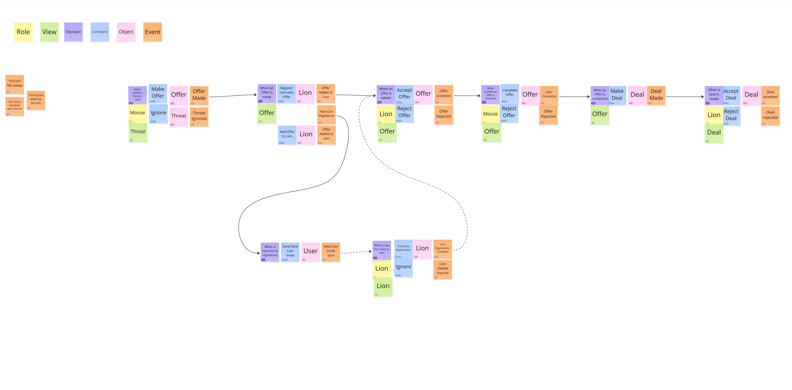
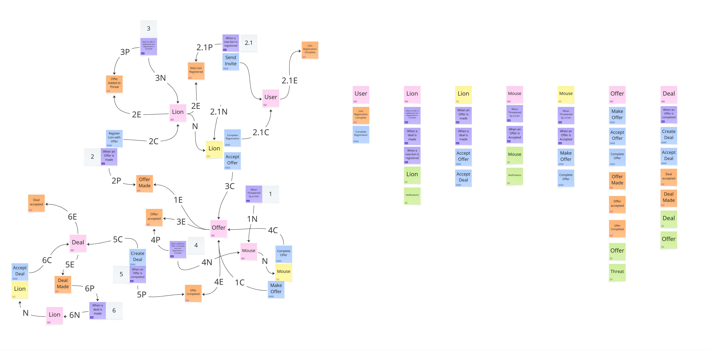

# lion-rescue-services
This is a sample project that demonstrates making an event driven system using a model discovered using EventStorming

The aim of the project is to proove that a model can be tied directly to code and demonstrate how the assets gathered during eventstorming maintain relevance throughout development.

This is also an oportunity to experiment with .Net Aspire to simplify orchestration of the moving parts and introduce a Service Descovery pattern

The system is based on a concept derived from a childrens story. For the story I have used The Aesops fable of The Lion and The Mouse  

*A Lion lay asleep in the forest, his great head resting on his paws. A timid little Mouse came upon him unexpectedly, and in her fright and haste to get away, ran across the Lion's nose.  
Roused from his nap, the Lion laid his huge paw angrily on the tiny creature to kill her. "Spare me!" begged the poor Mouse. "Please let me go and some day I will surely repay you."   
The Lion was much amused to think that a Mouse could ever help him. But he was generous and finally let the Mouse go.   
Some days later, while stalking his prey in the forest, the Lion was caught in the toils of a hunter's net. Unable to free himself, he filled the forest with his angry roaring.   
The Mouse knew the voice and quickly found the Lion struggling in the net. Running to one of the great ropes that bound him, she gnawed it until it parted, and soon the Lion was free.   
"You laughed when I said I would repay you," said the Mouse. "Now you see that even a Mouse can help a Lion.*   

From this story I have hypothesised that:   
If the Mouse had an application to track deals made with Lions   
They could offer the service to many lions,   
Increasing their chances of survival by 200%  

If the lion had an application to notify the mouse they are trapped
The lion has an effective way of requesting help,   
Increasing the chance of a Lions survival by 200%  

## Results of EventStorming:
**_NOTE:_** The model is a "work in progress" as I discover more about the application through implementation i might return to this model to update it before making large changes

### The Model

### The flow fo messages and the assignment of responsibility

## Lion Rescue Sales Context
This context will be where we implement the logic for intiating a sale of thew rescu services